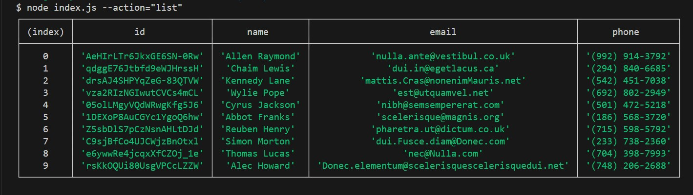
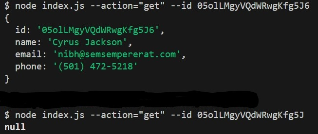
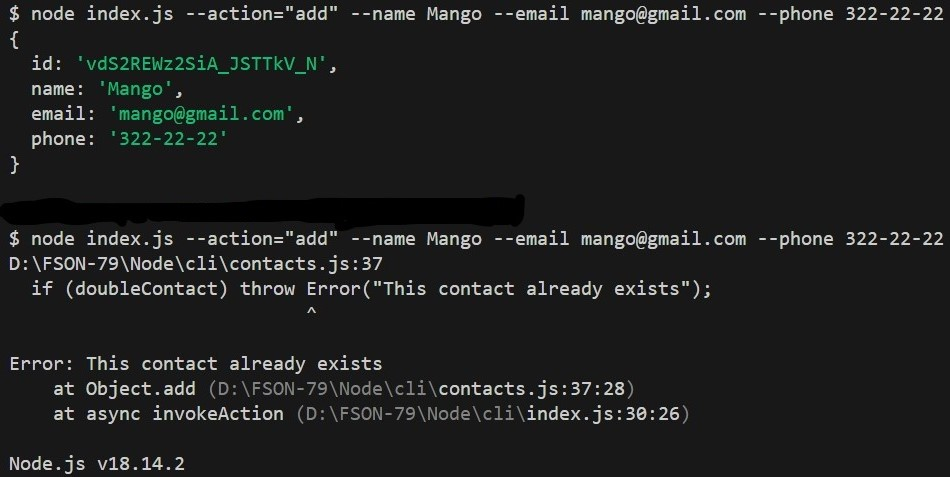
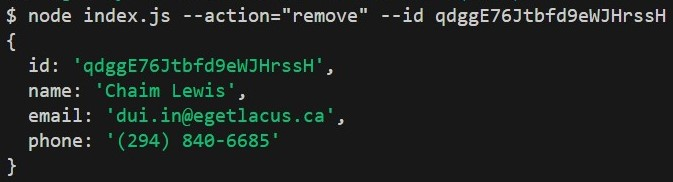

# CLI (command-line interface) applications on Node.js with Commander

File JSON request handling

## Tech Stack

**Server:** Node.js, Commander

## 🛠 Skills

Javascript, Node.js

## Screenshots

- Getting all contacts

- Get contact by ID

- Add new contact

- Remove contact

### Read on Ukrainian

[README.ukr](README.ukr.md)
