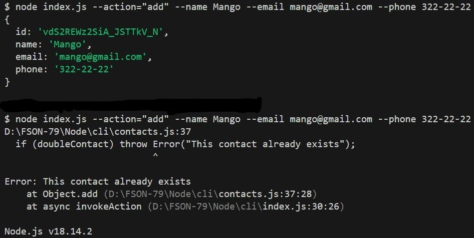

# Завдання

1. Ініціалізуй проєкт за допомогою команди `npm init`

- В корені проєкту створи файл `index.js`
- Встанови пакет `nodemon` як залежність розробки (devDependencies)
- В файлі `package.json` додай "скрипти" для запуску `index.js`
- Скрипт `start`, який запускає `index.js` за допомогою node
- Скрипт `dev`, який запускає `index.js` за допомогою nodemon

2. У корені проєкту створи папку `db`. Для зберігання контактів завантаж і використовуй файл `contacts.json`, поклавши його в папку db

- У корені проєкту створи файл `contacts.js`.
- Зроби імпорт модулів `fs` (у версії, яка працює з промісами - `fs/promises`) і `path` для роботи з файловою системою.
- Створи змінну `contactsPath` і запиши в неї шлях до файлу `contacts.json`. Для складання шляху використовуй методи модуля `path`.
- Додай функції для роботи з колекцією контактів. У функціях використовуй модуль fs та його методи `readFile()` і `writeFile()`.
- Зроби експорт створених функцій через `module.exports`.

3. Зроби імпорт модуля `contacts.js` в файлі `index.js` та перевір працездатність функцій для роботи з контактами.

4. У файлі `index.js` має імпортуватися пакет yargs для зручного парсу аргументів командного рядка. Використовуй готову функцію `invokeAction()`, яка отримує тип виконуваної дії і необхідні аргументи. Функція викликає відповідний метод з файлу `contacts.js`, передаючи йому необхідні аргументи.

- Також можеш використати модуль `commander` для парсингу аргументів командного рядка. Це більш популярна альтернатива модуля `yargs`.

5. Запусти команди в терміналі і зроби окремі скріншоти результату виконання кожної команди.

- Отримуємо і виводимо весь список контактів у вигляді таблиці

- Отримуємо контакт по id і виводимо у консоль об'єкт контакту або null, якщо контакту з таким id не існує

- Додаємо контакт та виводимо в консоль об'єкт новоствореного контакту

- Видаляємо контакт та виводимо в консоль об'єкт видаленого контакту або null, якщо контакту з таким id не існує

